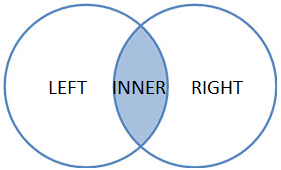

# @lopatnov/join

[](https://www.npmjs.com/package/@lopatnov/join)
[](https://www.npmjs.com/package/@lopatnov/join)
[](https://github.com/lopatnov/join/issues)
[](https://github.com/lopatnov/join/network)
[](https://github.com/lopatnov/join/stargazers)
[](https://github.com/lopatnov/join/blob/master/LICENSE)

[](https://github.com/lopatnov/join/tree/master/tests)
[](https://github.com/lopatnov/join/releases)

[](https://www.patreon.com/lopatnov)
[](https://twitter.com/intent/tweet?text=I%20want%20to%20share%20TypeScript%20library:&url=https%3A%2F%2Fwww.npmjs.com%2Fpackage%2F%40lopatnov%2Fjoin)
[](https://www.linkedin.com/in/lopatnov/)

Object join technics.

## Install

[](https://www.npmjs.com/package/@lopatnov/join)

```shell
npm install @lopatnov/join
```

[Browser](https://lopatnov.github.io/join/dist/join.js)

```html
<script src="https://lopatnov.github.io/join/dist/join.min.js"></script>
```

## Import package to the project

### TypeScript

```typescript
import { join, JoinTypes } from "@lopatnov/join";
```

### JavaScript

```javascript
var library = require("@lopatnov/join");
var join = library.join;
var JoinTypes = library.JoinTypes;
```

## Join Types



```typescript
enum JoinTypes {
  none       = 0b0000,
  left       = 0b1000, // take unique left object properties
  right      = 0b0001, // take unique right object properties
  innerLeft  = 0b0100, // take non-unique (inner) properties from left object
  innerRight = 0b0010, // take non-unique (inner) properties from right object
  innerJoin  = none | innerLeft | innerRight | none, // innerLeft + innerRight = deep merge inner join of two objects
  leftJoin   = left | innerLeft | innerRight | none,
  rightJoin  = none | innerLeft | innerRight | right,
  fullJoin   = left | innerLeft | innerRight | right,
  expand     = left | none      | innerRight | right
}
```

`JoinTypes.expand` is default join type

## How to use

```ts
// 1. Set join Type
function join(joinType?: JoinTypes) => (local function)<TContext>(context: TContext)
```

```ts
// 2. Set context (left object)
(local function)<TContext>(context: TContext) => (local function)<TJoinObject>(joinObject: TJoinObject)
```

```ts
// 3. Set join object (right object) and gets result
(local function)<TJoinObject>(joinObject: TJoinObject): TContext & TJoinObject
```

### As three separate operations

```typescript
const rightJoin = join(JoinTypes.right);

const contextJoinBy = rightJoin({
  sample1: "One",
  sample2: "Two",
  sample3: "Three",
});

const result = contextJoinBy({
  sample2: "Dos",
  sample3: "Tres",
  sample4: "Quatro",
});

console.log(result); // { sample4: "Quatro" }
```

```typescript
const leftJoin = join(JoinTypes.left);

const contextJoinBy = leftJoin({
  sample1: "One",
  sample2: "Two",
  sample3: "Three",
});

const result = contextJoinBy({
  sample2: "Dos",
  sample3: "Tres",
  sample4: "Quatro",
});

console.log(result); // { sample1: "One" }
```

```typescript
const complexJoin = join(JoinTypes.left | JoinTypes.innerLeft | JoinTypes.right);

const contextJoinBy = complexJoin({
  sample1: "One",
  sample2: "Two",
  sample3: "Three",
});

const result = contextJoinBy({
  sample2: "Dos",
  sample3: "Tres",
  sample4: "Quatro",
});

console.log(result); // {sample1: "One", sample2: "Two", sample3: "Three", sample4: "Quatro"}
```

```typescript
const result = join(JoinTypes.innerJoin)({
  sample1: "One",
  sample2: "Two",
  sample3: {
    smile: "cheese",
  },
})({
  sample2: "Dos",
  sample3: {
    sorrir: "queijo",
  },
  sample4: "Quatro",
});

console.log(result); // {sample2: "Dos", sample3: {smile: "cheese", sorrir: "queijo"}}
```

## Demo

See, how it's working: [https://runkit.com/lopatnov/join](https://runkit.com/lopatnov/join)

Test it with a runkit: [https://npm.runkit.com/@lopatnov/join](https://npm.runkit.com/%40lopatnov%2Fjoin)

## Rights and Agreements

License [Apache-2.0](https://github.com/lopatnov/join/blob/master/LICENSE)

Copyright 2020–2021 Oleksandr Lopatnov
